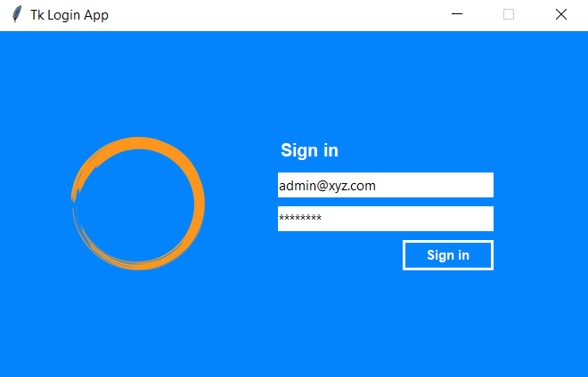

# About the Project
The project demonstrates a simple login application created using `Tkinter` GUI library for `Windows` and `Mac` Systems.

For testing, you can use the following `credentials` (however, later you can connect it to a `database`)

```code
Email    : admin@xyz.com
Password : password
```

You can check the `console` for successful login.

# Setting up the Environment
1. Clone the project.
```code
git clone "https://github.com/VikingPathak/tk_login_app.git"
```

2. Install `Pillow` (image library for python)
```code
pip install pillow
```

3. Run the program
```code
python main.py
```

[PNG Logo Link](https://pixabay.com/illustrations/orange-circle-logo-round-element-1618917/)


